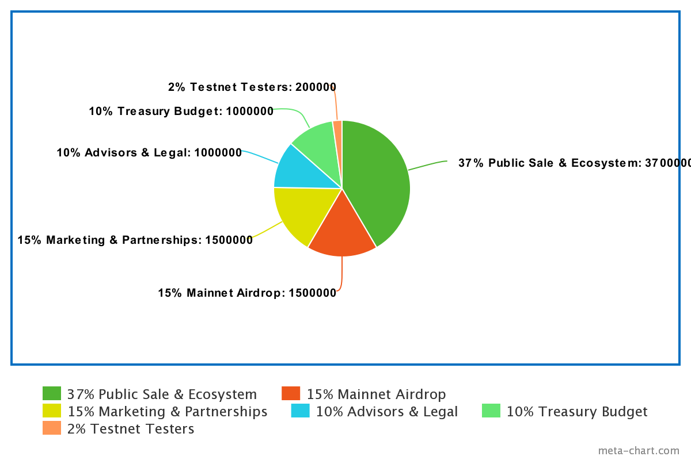

# Backable

<p align="center"></p>
<p>
  
</p>

[](https://app.netlify.com/sites/eloquent-yalow-ae8c51/deploys)


**Backable Address contract on Testnet**: `0x98d9d37089E93592ca583f42672b0155EE9D8465`

## What is Backable?
Backable is the first decentralized and collateralized stablecoin protocol with a value pegged to the US dollar on the Nervos network.

`1 BCUSD = 1 USD`.

Backable will bring stability to payments with cryptocurrencies to merchants and users who want to use them in their frequent payments and thanks to Nervos it will be part of the universal passport to blockchain.


Backable will open up new opportunities with a barrier-free and soon a more stable economy.

## Why Nervos?
Nervos breaks with several of the current problems of Bitcoin and Ethereum, mainly with the problem of the blockchain trilemma.

- Read about the Blockchain Trilemma [here](https://coinmarketcap.com/alexandria/glossary/blockchain-trilemma).

Nervos is the only blockchain that truly seeks interoperability, this allows Backable to not only reach Nervos users but also Ethereum users and soon other blockchains.

## Why Backable?

Cryptocurrencies are growing at an accelerated rate, even the country of El Salvador in Latin America allowed the use of Bitcoin as a legal means of payment, but this will bring a lot of conflict for certain types of payment such as micropayments and payments that require speed, confirmation almost instantaneous and price stability in the face of fluctuations.

That is why Backable was born to provide a stable currency (for the moment pegged to the USD nothing else), fast payments and allowing micropayments as well.

Backable will not only be a protocol to allow a decentralized collateralized stablecoin, but it also hopes to become a whole monetary ecosystem for the new interoperable web 3.0.

## What role does NATOR play within Backable?

Technology projects, and especially the most innovative ones, may fail in the future due to lack of good government or just someone to govern them. So it is crucial to ensure the project in the long term and that it is better managed by your own community.

That is why the governance token, `NATOR`, was created, which will have a voting weight at the project level and will allow users who so decide to become a Backable governor.

Among the options that can be voted on are:

- Smart contracts and protocol updates
- Policies
- Reward percentage
- Percentage of the fund for contributors
- Partnerships

At the beginning of Backable's development, voting will be off-chain through a web platform, but as the project evolves it will become a chain.

## NATOR's Tokenomics

**Market Cap**: `10,000,000 NATOR`



## Build Frontend


```
$cd app
```

```
$npm install
```

```
$npm run build
```

or dev

```
$npm run start
```
